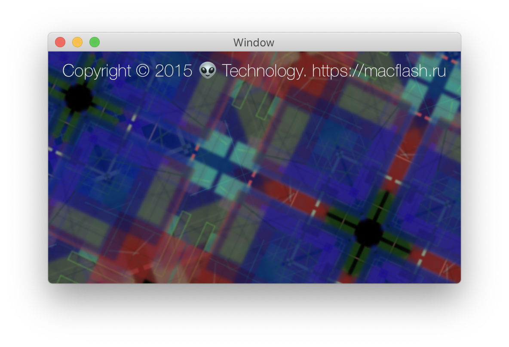
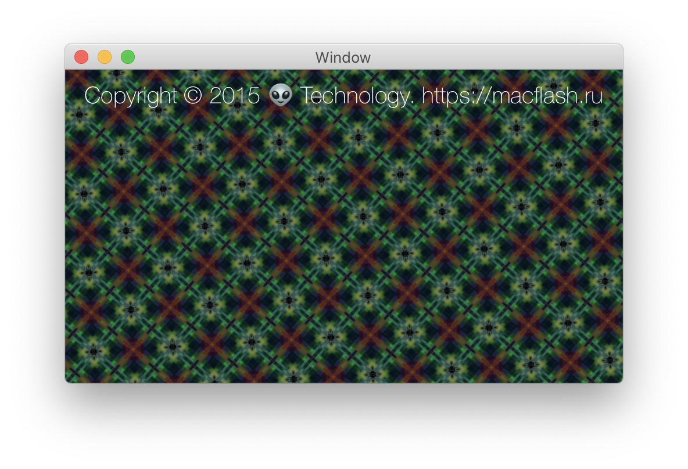

# Magic

Beautiful screensaver with generative patterns. Free for all.
Suitable as an example.

It is possible to check the result through the MagicTest application for mac.

[Magic Screensaver Installer](https://github.com/svanichkin/Magic/blob/master/SignedMagicSaver.pkg?raw=true)

